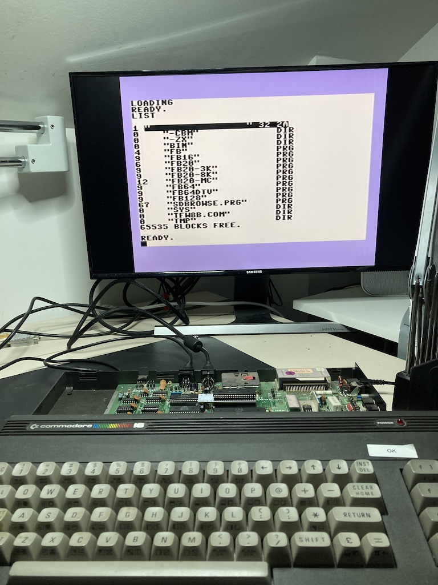
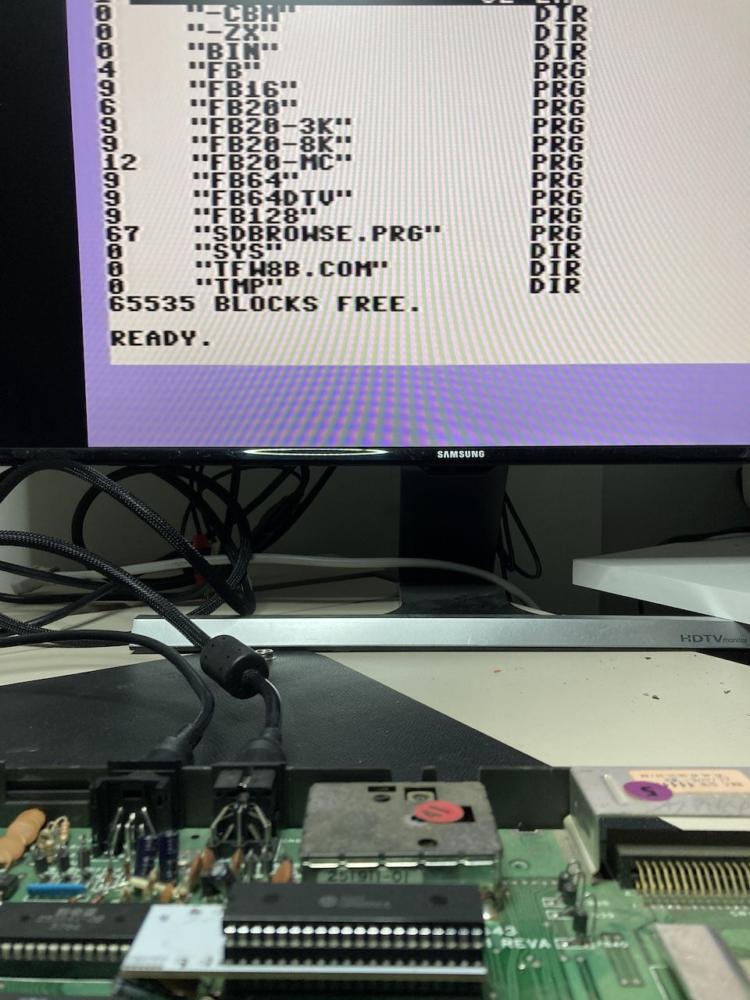

# 7501/8501 to 6502 Adapter Schematic and Printed Circuit Board
This PCB will allow a 65(c)02 CPU to emulate a CSG/MOS 7501/8501 CPU.

## Theory
The 6502 address, data, and r/w lines are fed through the CPLD so they cna be optionally tri-stated, and the on-board PIO port lines 0-6 are emulated.

## Test
This circuit was sucessfully tested on a Commodore C16 with a SD2IEC floppy emulator.
Some pictures of the circuit installed and running:

## License
Copyright (C) 2018  Jim Brain, RETRO Innovations

These files are free designs; you can redistribute them and/or modify
them under the terms of the Creative Commons Attribution-ShareAlike 
4.0 International License.

You should have received a copy of the license along with this
work. If not, see <http://creativecommons.org/licenses/by-sa/4.0/>.

These files are distributed in the hope that they will be useful,
but WITHOUT ANY WARRANTY; without even the implied warranty of
MERCHANTABILITY or FITNESS FOR A PARTICULAR PURPOSE.  See the
license for more details.

